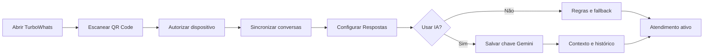
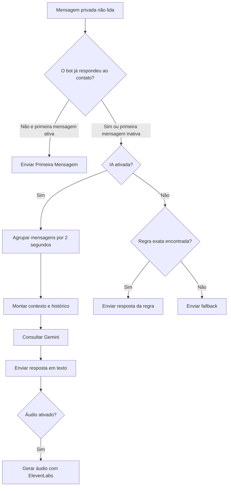
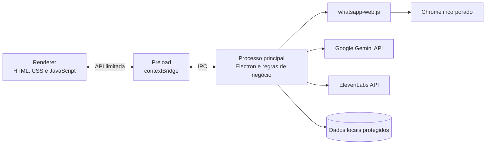

<p align="center">
  
</p>

<h1 align="center">TurboWhats</h1>

<p align="center">
  <strong>Atendimento inteligente, automação e campanhas para WhatsApp em um aplicativo desktop.</strong>
</p>

<p align="center">
  <a href="https://github.com/louro2023/ChatbotcomIA/releases/tag/v1.0.3"></a>
  
  
  
  <a href="LICENSE"></a>
</p>

<p align="center">
  <a href="https://github.com/louro2023/ChatbotcomIA/releases/download/v1.0.3/TurboWhats-Portable-1.0.3.exe"><strong>Baixar versão portátil</strong></a>
  ·
  <a href="https://github.com/louro2023/ChatbotcomIA/releases/tag/v1.0.3">Ver Release</a>
  ·
  <a href="https://github.com/louro2023/ChatbotcomIA/issues">Reportar problema</a>
</p>

---

## Visão geral

O **TurboWhats** é uma aplicação desktop para Windows criada para centralizar automação de atendimento, inteligência artificial, respostas por voz e campanhas personalizadas em uma interface simples.

O sistema conecta uma conta por QR Code, acompanha conversas privadas com notificações não lidas, envia a primeira resposta configurada e continua o atendimento de duas formas: por regras determinísticas ou com respostas contextuais geradas pelo Google Gemini.

O projeto foi desenvolvido como uma solução completa de produto: possui identidade visual própria, onboarding orientado, persistência segura, diagnóstico de mensagens, build portátil e documentação para usuário e desenvolvedor.

> [!IMPORTANT]
> O TurboWhats utiliza automação do WhatsApp Web por meio de `whatsapp-web.js`. Não é uma integração oficial da API WhatsApp Business. Mudanças no WhatsApp Web podem afetar o funcionamento. Use o sistema somente em atendimentos e campanhas autorizados pelos destinatários.

## O problema

Pequenos negócios frequentemente precisam responder perguntas repetidas, manter um atendimento inicial consistente e organizar contatos sem adotar plataformas complexas ou fragmentar o trabalho entre várias ferramentas.

Os principais desafios tratados pelo projeto foram:

- evitar que mensagens realmente não lidas fiquem sem retorno;
- permitir automação mesmo sem contratar uma IA;
- oferecer IA opcional sem esconder do usuário quando ela está ativa;
- manter configurações e sessão após reiniciar o aplicativo;
- simplificar o cadastro internacional de telefones;
- explicar claramente o que acontece depois da leitura do QR Code;
- distribuir tudo em um único executável para Windows.

## A solução

O TurboWhats combina cinco módulos em uma experiência única:

| Módulo | O que entrega |
| --- | --- |
| **Conexão** | QR Code, autenticação, sincronização orientada, reconexão e sessão persistente |
| **Respostas** | Primeira mensagem, regras exatas e fallback quando a IA está desligada |
| **IA & Voz** | Gemini, contexto personalizado, histórico opcional e áudio com ElevenLabs |
| **Disparos** | Cadastro, importação CSV/XLSX, tags, imagem, intervalo e progresso por contato |
| **Ajuda** | Orientações integradas sobre fluxos, chaves de API, limites e boas práticas |

## Destaques do produto

### Atendimento híbrido

O usuário escolhe entre um fluxo previsível baseado em regras e um atendimento contextual com IA. A primeira mensagem pode introduzir o atendimento nos dois modos.

### Rastreamento de não lidas

Além de ouvir novas mensagens em tempo real, o sistema revisa periodicamente conversas privadas com notificação ativa ou marcadas como não lidas. O rastreador usa controles contra duplicidade e registra decisões técnicas para diagnóstico.

### IA controlada pelo usuário

A chave do Gemini é testada antes de ser salva. A IA possui ativação independente, contexto editável, histórico opcional e painel local de uso de tokens. O teste de conexão usa timeout ampliado e novas tentativas para lidar melhor com redes lentas.

### Campanhas com menos erros de telefone

No cadastro manual, o telefone é dividido em **País**, **DDD** e **Número**. Uma prévia mostra o formato final antes de salvar.

```text
País: Brasil (+55)
DDD: 21
Número: 981682922
Prévia: +55 (21) 98168-2922
```

### Experiência portátil

O executável inclui Electron e um Chrome compatível com a automação. O usuário final não precisa instalar VS Code, Node.js, npm ou navegador adicional. Uma instalação nova começa sem contatos, chaves ou sessão herdada do ambiente de desenvolvimento.

## Jornada principal do usuário



A tela de conexão comunica cada estado real recebido do WhatsApp:

1. **QR Code:** aguarda a leitura pelo celular.
2. **Autenticação:** confirma que o dispositivo foi autorizado.
3. **Sincronização:** organiza conversas e mensagens não lidas.
4. **Concluído:** informa que o atendimento está disponível.

## Fluxo das respostas automáticas



### IA ativada

1. Na primeira resposta automática para o contato, o sistema envia a mensagem inicial configurada.
2. Nas mensagens seguintes, conteúdos recebidos em um intervalo curto são agrupados.
3. O Gemini responde seguindo as instruções salvas e, opcionalmente, o histórico recente.
4. Se voz estiver ativa e configurada, a mesma resposta também é enviada em áudio.

### IA desativada

1. O contato recebe a primeira mensagem, caso ainda não tenha recebido uma resposta do bot.
2. O texto seguinte é comparado às palavras-chave cadastradas.
3. Uma correspondência exata envia a resposta da regra.
4. Se nenhuma regra corresponder, o fallback orienta o contato.

Uma regra para `horário` não corresponde automaticamente a `horário?`. Essa decisão mantém o comportamento previsível; variações podem ser cadastradas separadamente.

## Arquitetura

O projeto usa a separação de processos recomendada pelo Electron. A interface não acessa diretamente Node.js, arquivos ou credenciais.



### Responsabilidades

| Camada | Responsabilidade |
| --- | --- |
| `Electron/index.html` | Estrutura semântica das telas e formulários |
| `Electron/style.css` | Design system, responsividade, estados e identidade TurboWhats |
| `Electron/renderer.js` | Interações da interface, validação e renderização de dados |
| `Electron/preload.js` | Contrato seguro de comunicação entre interface e processo principal |
| `Electron/main.js` | WhatsApp, Gemini, voz, persistência, rastreamento e campanhas |
| `scripts/` | Inicialização, preparação da marca e navegador do build |

## Decisões técnicas relevantes

- **Electron com `contextIsolation`:** mantém a interface separada das APIs do sistema.
- **`LocalAuth`:** preserva a sessão do WhatsApp entre inicializações.
- **Scanner a cada 8 segundos:** recupera mensagens com notificação que não chegaram pelo evento em tempo real.
- **Fila de 2 segundos:** agrupa mensagens consecutivas antes de consultar a IA.
- **Gemini com timeout de 90 segundos:** reduz falsos erros em conexões lentas.
- **Até três tentativas de IA:** repete falhas temporárias com espera progressiva.
- **Configuração local protegida:** usa `safeStorage` para chaves quando a criptografia do Windows está disponível.
- **ASAR e Chrome incorporado:** entrega um único executável portátil e reproduzível.
- **Dados de produção isolados:** o portátil usa uma pasta diferente do ambiente executado pelo código-fonte.

## Tecnologias

| Tecnologia | Uso no projeto |
| --- | --- |
| **Electron 43** | Aplicação desktop e APIs do Windows |
| **JavaScript** | Regras de negócio e interface |
| **HTML5 e CSS3** | Estrutura e identidade visual |
| **whatsapp-web.js** | Sessão e troca de mensagens pelo WhatsApp Web |
| **Google Gemini 3.5 Flash** | Respostas contextuais e conteúdo multimodal |
| **ElevenLabs** | Conversão opcional de texto em voz |
| **ExcelJS** | Importação de contatos CSV/XLSX |
| **QRCode** | Renderização do código de conexão |
| **electron-builder** | Empacotamento portátil para Windows x64 |

## Segurança e privacidade

O projeto aplica controles em várias camadas:

- `nodeIntegration` desativado no renderer;
- `contextIsolation` e sandbox ativados;
- funções IPC expostas por uma API mínima no preload;
- navegação externa limitada aos domínios autorizados;
- chaves protegidas com `safeStorage` quando disponível;
- configurações, sessões, logs, caches e `.env` ignorados pelo Git;
- contatos e chaves ausentes do executável distribuído;
- identificadores anonimizados no controle da primeira mensagem.

Boas práticas para operação:

- revogue imediatamente qualquer chave publicada por engano;
- não compartilhe `config.json` ou `whatsapp-session/`;
- evite enviar informações sigilosas à IA sem revisar os termos do provedor;
- envie campanhas somente para contatos que autorizaram o recebimento;
- respeite limites, políticas e termos do WhatsApp e das APIs utilizadas.

## Instalação

### Versão portátil

Baixe o arquivo na página de Releases:

**[TurboWhats-Portable-1.0.3.exe](https://github.com/louro2023/ChatbotcomIA/releases/download/v1.0.3/TurboWhats-Portable-1.0.3.exe)**

Requisitos do usuário final:

- Windows 10 ou Windows 11 x64;
- acesso à internet;
- conta do WhatsApp com suporte a aparelhos conectados;
- chave Gemini somente para usar IA;
- chave ElevenLabs somente para usar voz.

O executável possui aproximadamente 203 MB porque inclui o ambiente Electron e o Chrome usado pela automação.

> [!NOTE]
> O projeto ainda não possui certificado comercial de assinatura. O Windows SmartScreen pode exibir **Editor desconhecido** na primeira execução. Confira a origem e o hash antes de autorizar.

SHA-256 da versão 1.0.3:

```text
041AB380FC26DB018A90CF0DAC2ABD7BF9CC13780DDAEFDBBF80DCD51D3FD787
```

### Executar pelo código-fonte

```powershell
git clone https://github.com/louro2023/ChatbotcomIA.git
cd ChatbotcomIA
npm install
npm start
```

O inicializador do Windows libera o terminal e mantém somente a janela do TurboWhats aberta.

## Primeiros passos

### 1. Conectar o WhatsApp

1. Abra **Status**.
2. No celular, acesse **WhatsApp > Aparelhos conectados > Conectar aparelho**.
3. Leia o QR Code.
4. Mantenha o TurboWhats aberto durante a autenticação e sincronização.

Use **Reconectar** para recuperar a sessão atual. Use **Resetar conexão** para encerrar a sessão local e gerar um QR Code novo.

### 2. Configurar respostas sem IA

Na aba **Respostas**:

1. ative **Mensagens padrão**;
2. escreva a primeira resposta do bot;
3. cadastre palavras-chave e respostas;
4. configure o fallback;
5. mantenha a IA desativada durante o teste das regras.

### 3. Conseguir uma chave gratuita do Gemini

1. Acesse o [Google AI Studio — API Keys](https://aistudio.google.com/apikey).
2. Entre com uma conta Google e aceite os termos.
3. Crie ou selecione um projeto.
4. Clique em **Create API key** e copie a chave.
5. Em **IA & Voz**, cole a chave e selecione **Salvar e ativar API Key**.

O TurboWhats testa a API antes de salvar. O Free Tier e seus limites dependem da região, do projeto e das regras atuais do Google. Consulte a [documentação de preços do Gemini](https://ai.google.dev/gemini-api/docs/pricing).

### 4. Orientar a IA

Exemplo de contexto:

```text
Você é o assistente da Empresa Exemplo.
Responda em português, seja objetivo e cordial.
O atendimento funciona de segunda a sexta, das 8h às 18h.
Não invente preços, prazos ou políticas.
Quando não souber, encaminhe para um atendente humano.
```

Ative **Manter histórico** somente quando respostas anteriores forem relevantes para o atendimento.

### 5. Responder também em áudio

1. Obtenha uma chave no [ElevenLabs](https://elevenlabs.io/).
2. Informe a chave e escolha a voz.
3. Ative **Responder também em áudio**.

Sem ElevenLabs configurado, o atendimento em texto continua funcionando normalmente.

## Disparos personalizados

O módulo de campanhas permite:

- cadastrar contatos com país, DDD e número separados;
- importar planilhas CSV ou XLSX;
- selecionar destinatários individualmente ou em grupo;
- usar texto, imagem ou ambos;
- personalizar mensagens com tags;
- definir intervalo entre envios;
- acompanhar enviados e falhas;
- cancelar uma campanha em andamento.

Colunas reconhecidas na importação:

- `Nome` ou `Contato`;
- `WhatsApp`, `Telefone`, `Celular`, `Número` ou `Phone`.

Números brasileiros importados com 10 ou 11 dígitos recebem `55` automaticamente. Para outros países, inclua o código internacional.

| Tag | Resultado |
| --- | --- |
| `{Nome}` | Nome completo do contato |
| `{PrimeiroNome}` | Primeiro nome |
| `{Telefone}` | Telefone formatado |
| `{Data}` | Data do envio em formato brasileiro |
| `{Hora}` | Horário do envio |

## Tokens e limites da IA

O painel acumula localmente os metadados retornados pelo Gemini:

- solicitações;
- tokens de entrada;
- tokens de resposta;
- tokens de raciocínio;
- total processado.

Esse painel representa apenas o uso registrado nesta instalação. A API de geração não informa o saldo restante do Free Tier; a cota oficial deve ser consultada no Google AI Studio.

## Persistência de dados

Dados do portátil:

```text
%APPDATA%\TurboWhats-Portable\app-data
```

Dados do ambiente de desenvolvimento:

```text
%APPDATA%\cchatbot\app-data
```

| Item | Finalidade |
| --- | --- |
| `config.json` | Mensagens, regras, contatos, opções e chaves protegidas |
| `whatsapp-session/` | Sessão local do WhatsApp |
| `gemini-usage.json` | Contador local de solicitações e tokens |
| `first-message-state.json` | Controle anonimizado da primeira resposta |
| `runtime-errors.log` | Erros de execução para diagnóstico |
| `message-tracker.log` | Decisões do rastreador de mensagens |

## Estrutura do projeto

```text
ChatbotcomIA/
├── Electron/
│   ├── assets/
│   │   └── turbowhats-icon.png
│   ├── index.html
│   ├── main.js
│   ├── preload.js
│   ├── renderer.js
│   └── style.css
├── scripts/
│   ├── prepare-brand-assets.mjs
│   ├── prepare-browser.js
│   └── run-electron.js
├── icone.png
├── LICENSE
├── package.json
├── package-lock.json
└── README.md
```

## Desenvolvimento e build

| Comando | Finalidade |
| --- | --- |
| `npm start` | Inicia o aplicativo |
| `npm run check` | Verifica a sintaxe dos arquivos JavaScript |
| `npm run smoke` | Executa uma inicialização rápida de diagnóstico |
| `npm run prepare:brand` | Prepara PNG e ICO da identidade TurboWhats |
| `npm run prepare:browser` | Copia o Chrome compatível para o cache do build |
| `npm run pack:win` | Gera a pasta Windows descompactada para testes |
| `npm run build:win` | Gera o portátil único para Windows x64 |

Validação recomendada:

```powershell
npm run check
npm run smoke
```

Build final:

```powershell
npm install
npm run build:win
```

O `electron-builder` gera `dist\TurboWhats-Portable-<versão>.exe`. A compilação incorpora aproximadamente 408 MB de recursos do navegador antes da compactação e pode exigir cerca de 1 GB de espaço temporário.

## Testes realizados na versão 1.0.3

- verificação de sintaxe dos processos principal, preload, renderer e scripts;
- smoke test do Electron;
- validação de IDs únicos na interface;
- teste de montagem e formatação internacional de telefones;
- teste do contato brasileiro `+55 (21) 98168-2922`;
- inicialização do aplicativo empacotado;
- inspeção do conteúdo ASAR;
- confirmação de ausência de configurações pessoais no pacote;
- verificação do executável pelo Microsoft Defender;
- validação do SHA-256 publicado na Release.

## Solução de problemas

### O QR Code não aparece

- verifique a conexão com a internet;
- aguarde a preparação inicial;
- use **Resetar conexão** para remover a sessão anterior;
- confirme que o Chrome incorporado está presente no pacote.

### Uma mensagem não lida não recebeu resposta

- confirme que a conversa possui notificação ativa ou foi marcada como não lida;
- grupos e status são ignorados pelo atendimento automático;
- verifique se **Mensagens padrão** ou **IA** estão ativas;
- consulte `runtime-errors.log` e `message-tracker.log`.

### A IA não responde

- salve a chave novamente para repetir o teste;
- confirme que **IA ativada** está ligada;
- verifique cota, região e permissões no Google AI Studio;
- revise os contextos e filtros de segurança do projeto.

### Uma regra não corresponde

- desative a IA durante o teste;
- use exatamente o texto cadastrado;
- crie variações separadas para acentos, frases e pontuação;
- lembre que a primeira interação envia primeiro a mensagem inicial.

### O áudio não é enviado

- confirme a chave e a voz do ElevenLabs;
- ative **Responder também em áudio**;
- verifique a cota do provedor;
- confirme que o texto foi enviado normalmente.

## Evolução do projeto

Possíveis próximos passos:

- assinatura digital do executável Windows;
- testes automatizados de interface e integração;
- painel de métricas de atendimento;
- exportação de relatórios de campanhas;
- regras com correspondência parcial ou expressões configuráveis;
- suporte a múltiplos perfis de atendimento;
- atualização automática do aplicativo;
- opção de integração oficial com a WhatsApp Business Platform.

## Uso em portfólio

Este projeto demonstra competências em:

- descoberta e refinamento de requisitos a partir de problemas reais;
- desenvolvimento de aplicações desktop com Electron;
- integração com WhatsApp Web e APIs generativas;
- desenho de fluxos híbridos entre automação determinística e IA;
- segurança de IPC, credenciais e dados persistentes;
- modelagem de estados assíncronos e recuperação de falhas;
- UX writing para onboarding e carregamentos longos;
- importação e normalização de dados;
- criação de build portátil e processo de distribuição;
- documentação técnica e apresentação de produto.

## Contribuição

1. Faça um fork do repositório.
2. Crie uma branch para a alteração.
3. Execute `npm run check` e `npm run smoke`.
4. Abra um Pull Request explicando motivação, impacto e validação.

Relate problemas pelas [Issues](https://github.com/louro2023/ChatbotcomIA/issues). Nunca inclua chaves, números, sessões ou conversas nos relatórios.

## Licença

Distribuído sob a licença MIT. Consulte [LICENSE](LICENSE).

## Autor

Desenvolvido por **[Henrique Louro](https://github.com/louro2023)**.

---

<p align="center">
  <strong>TurboWhats</strong><br>
  Atendimento inteligente para WhatsApp.
</p>
