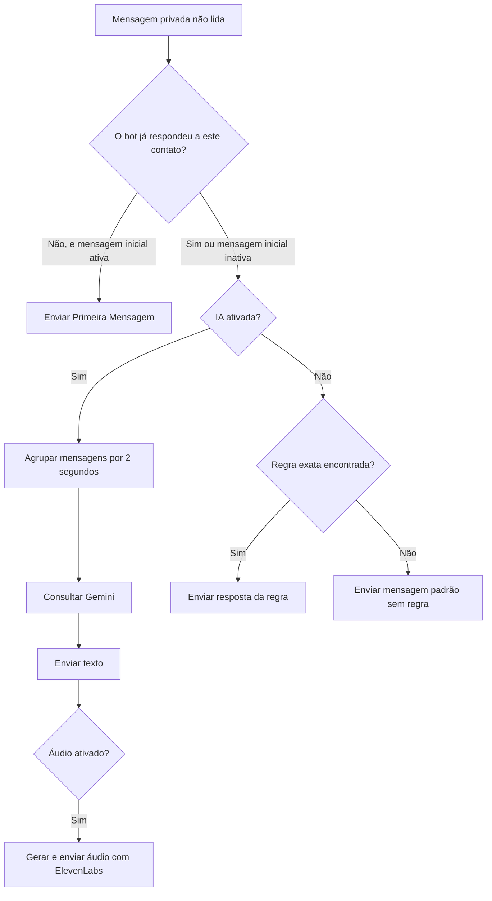

# TurboWhats — atendimento inteligente para WhatsApp

O TurboWhats é um aplicativo desktop para Windows que conecta uma conta do WhatsApp Web e automatiza atendimentos com mensagens iniciais, regras por palavra-chave, Google Gemini, respostas em áudio e disparos personalizados.

O painel é executado com Electron e mantém configurações e sessão localmente, permitindo reabrir o sistema sem configurar tudo novamente.

> **Aviso:** este projeto usa automação do WhatsApp Web por meio da biblioteca `whatsapp-web.js`; não é uma integração oficial da API WhatsApp Business. Mudanças no WhatsApp Web podem afetar o funcionamento. Use somente com contatos que autorizaram o atendimento e respeite os termos aplicáveis.

## Recursos

- Conexão por QR Code e persistência da sessão do WhatsApp.
- Reconexão automática e opção para gerar uma sessão nova.
- Rastreamento de conversas privadas com notificação não lida ou marcadas como não lidas.
- Primeira mensagem automática por sessão de atendimento.
- Regras exatas por palavra-chave quando a IA está desativada.
- Resposta padrão quando nenhuma regra corresponde.
- Google Gemini 3.5 Flash para respostas contextuais.
- Histórico recente de conversa opcional.
- Leitura multimodal de imagens, áudios, vídeos e PDFs compatíveis.
- Contador local de solicitações e tokens informados pelo Gemini.
- Resposta em áudio opcional com ElevenLabs.
- Importação de contatos por CSV/XLSX e disparos personalizados.
- Interface de ajuda integrada ao aplicativo.
- Configurações, chaves e sessão persistentes entre reinicializações.

## Fluxo do atendimento



### Quando a IA está ativada

1. Na primeira resposta automática para cada contato, ele recebe a mensagem inicial configurada.
2. A partir da próxima mensagem, o sistema agrupa mensagens próximas por dois segundos.
3. O Gemini responde considerando as instruções salvas e, opcionalmente, o histórico.
4. Se a resposta em áudio estiver ativada e o ElevenLabs estiver configurado, o sistema envia texto e áudio.

### Quando a IA está desativada

1. Se o bot ainda nunca respondeu ao contato, envia a **Primeira Mensagem**, se as mensagens padrão estiverem ativas.
2. Nas mensagens seguintes, o sistema procura uma regra cuja palavra-chave seja exatamente igual ao texto recebido. A comparação ignora maiúsculas, minúsculas e espaços nas extremidades.
3. Se nenhuma regra corresponder, envia a mensagem padrão de fallback.

Exemplo: uma regra para `horário` não corresponde automaticamente a `horário?` ou `qual o horário`. Cadastre as variações necessárias como regras separadas.

## Requisitos

- Windows 10 ou Windows 11.
- Node.js e npm instalados. Recomenda-se uma versão LTS atual do Node.js.
- Conta do WhatsApp capaz de conectar aparelhos pelo QR Code.
- Internet para WhatsApp Web e integrações externas.
- Chave do Google Gemini para usar IA.
- Chave do ElevenLabs somente se desejar respostas em áudio.

## Instalação

### Executável portátil — usuário final

O arquivo pronto fica em:

```text
dist\TurboWhats-Portable-1.0.3.exe
```

Basta copiar esse único arquivo para um computador Windows x64 e executá-lo. O usuário final não precisa instalar VS Code, Node.js, npm, Electron, Chrome ou Edge. O pacote inclui o Electron e um Chrome compatível usado exclusivamente pela automação do WhatsApp.

Na primeira abertura, o portátil extrai seus componentes para uma pasta temporária do Windows. Por isso, a inicialização pode levar alguns segundos. Ele começa sem contatos, chaves de API ou sessão do WhatsApp e não importa dados da versão executada pelo código-fonte. Depois que o usuário salvar suas próprias configurações, elas ficam em `%APPDATA%\TurboWhats-Portable\app-data` e continuam disponíveis mesmo que o `.exe` seja movido ou substituído por uma versão nova.

Como o projeto não possui um certificado comercial de assinatura de código, o Windows SmartScreen pode mostrar **Editor desconhecido**. Confira a origem do arquivo e o hash publicado antes de autorizar a execução.

### Executar pelo código-fonte

```powershell
git clone https://github.com/louro2023/ChatbotcomIA.git
cd ChatbotcomIA
npm install
npm start
```

No Windows, o inicializador libera o terminal e mantém somente a janela do aplicativo aberta.

## Primeira configuração

### 1. Conectar o WhatsApp

1. Abra a aba **Status**.
2. No celular, acesse **WhatsApp > Aparelhos conectados > Conectar um aparelho**.
3. Escaneie o QR Code exibido no sistema.
4. Aguarde a sincronização terminar.

O botão **Reconectar WhatsApp** tenta recuperar a sessão atual. **Resetar conexão** remove a sessão local e solicita um novo QR Code.

### 2. Configurar respostas sem IA

Na aba **Respostas**:

1. Salve a mensagem usada como primeira resposta automática do bot.
2. Cadastre palavras-chave e respostas automáticas.
3. Salve uma mensagem de fallback para quando nenhuma regra corresponder.
4. Desative a IA na aba **IA & Voz** para testar as regras.

A chave **Mensagens padrão** controla a primeira mensagem e o fallback. As regras permanecem cadastradas e são utilizadas quando a IA está desligada.

### 3. Obter e configurar uma chave Gemini

1. Acesse [Google AI Studio — API Keys](https://aistudio.google.com/apikey).
2. Entre com uma conta Google e aceite os termos apresentados.
3. Crie ou selecione um projeto e escolha **Create API key**.
4. Copie a chave.
5. No aplicativo, abra **IA & Voz**, cole a chave e clique em **Salvar e ativar API Key**.

O sistema testa a conexão antes de salvar. O Free Tier depende da região, do projeto e dos limites definidos pelo Google. Consulte a [documentação de preços](https://ai.google.dev/gemini-api/docs/pricing).

Nunca publique ou envie sua chave junto com o código.

### 4. Personalizar o comportamento da IA

Em **IA & Voz**, adicione instruções como:

```text
Você é o assistente da Empresa Exemplo.
Responda em português, seja objetivo e cordial.
O atendimento funciona de segunda a sexta, das 8h às 18h.
Não invente preços, prazos ou políticas.
```

Use **Manter histórico da conversa** quando a IA precisar considerar mensagens anteriores. Desative a opção em atendimentos que não precisam de memória contextual.

### 5. Configurar respostas em áudio

1. Crie uma conta e uma chave no [ElevenLabs](https://elevenlabs.io/).
2. Cole a chave na área de voz.
3. Escolha uma voz e salve.
4. Ative **Responder também em áudio**.

A chave do ElevenLabs é diferente da chave do Gemini. Sem uma chave válida, o atendimento por texto continua funcionando.

## Disparos personalizados

A aba **Disparos** permite cadastrar contatos manualmente escolhendo o país e informando o DDD e o número em campos separados. Por exemplo: `Brasil (+55)`, DDD `21` e número `981682922`. A prévia mostra o telefone completo antes de salvar, reduzindo erros de digitação.

Também é possível importar CSV/XLSX. A planilha deve conter:

- uma coluna `Nome`;
- uma coluna `WhatsApp`, `Telefone`, `Celular` ou `Número`.

Números brasileiros importados com 10 ou 11 dígitos recebem o código do país `55` automaticamente. Para outros países, inclua o código internacional na planilha. Revise os contatos antes de iniciar.

Tags disponíveis:

| Tag | Resultado |
| --- | --- |
| `{Nome}` | Nome completo do contato |
| `{PrimeiroNome}` | Primeiro nome |
| `{Telefone}` | Telefone cadastrado |
| `{Data}` | Data do envio em formato brasileiro |
| `{Hora}` | Horário do envio |

É possível enviar texto, imagem ou ambos, definir o intervalo entre os contatos, acompanhar o progresso e cancelar o processo.

## Consumo de tokens

O Gemini retorna metadados de uso em cada resposta. O aplicativo acumula localmente:

- solicitações;
- tokens de entrada;
- tokens de resposta;
- tokens de raciocínio;
- total de tokens.

Esse contador começa quando a funcionalidade é utilizada nesta instalação. Ele não representa o saldo da conta. A API de geração não informa quantos créditos gratuitos ainda restam; consulte as cotas no Google AI Studio.

## Dados persistentes

No Windows, a versão portátil salva seus dados em:

```text
%APPDATA%\TurboWhats-Portable\app-data
```

Ao executar pelo código-fonte, os dados de desenvolvimento permanecem separados em `%APPDATA%\cchatbot\app-data`.

Principais itens:

| Item | Finalidade |
| --- | --- |
| `config.json` | Mensagens, regras, contatos, opções da IA e chaves protegidas |
| `whatsapp-session/` | Sessão local gerenciada pelo `LocalAuth` |
| `gemini-usage.json` | Contador local de tokens e solicitações |
| `first-message-state.json` | Identificadores anonimizados dos contatos que já receberam uma resposta |
| `runtime-errors.log` | Diagnóstico de erros de execução |
| `message-tracker.log` | Rastreamento técnico de mensagens processadas |

Esses dados não devem ser versionados ou compartilhados. No Windows, as chaves são protegidas com `safeStorage` do Electron quando a criptografia do sistema está disponível.

## Segurança

- `contextIsolation` ativado.
- `nodeIntegration` desativado no renderer.
- Comunicação da interface limitada às funções expostas pelo preload.
- Navegação externa restrita aos domínios permitidos pelo processo principal.
- Chaves persistidas com `safeStorage` quando disponível.
- Configurações, sessões, logs, caches e arquivos `.env` ignorados pelo Git.

Mesmo com essas proteções:

- revogue imediatamente qualquer chave publicada por engano;
- não faça commit de `config.json`;
- não compartilhe a pasta `whatsapp-session`;
- use disparos apenas com autorização dos destinatários;
- evite enviar dados pessoais ou sigilosos ao nível gratuito da IA sem revisar os termos do provedor.

## Estrutura

```text
ChatbotcomIA/
├── Electron/
│   ├── index.html       # Estrutura da interface
│   ├── main.js          # Electron, WhatsApp, Gemini, voz e persistência
│   ├── preload.js       # Ponte IPC segura
│   ├── renderer.js      # Eventos e comportamento da interface
│   └── style.css        # Layout e estilos
├── scripts/
│   └── run-electron.js  # Inicialização sem prompt persistente no Windows
├── .gitignore
├── LICENSE
├── package.json
└── package-lock.json
```

## Scripts

| Comando | Finalidade |
| --- | --- |
| `npm start` | Inicia o aplicativo |
| `npm run check` | Verifica a sintaxe dos arquivos JavaScript |
| `npm run smoke` | Executa uma inicialização rápida de diagnóstico |
| `npm run prepare:brand` | Prepara o PNG e o ícone do TurboWhats usados no aplicativo e no executável |
| `npm run prepare:browser` | Copia o Chrome compatível para o cache de build |
| `npm run pack:win` | Gera uma pasta Windows descompactada para testes |
| `npm run build:win` | Gera o executável portátil único para Windows x64 |

Antes de enviar mudanças:

```powershell
npm run check
npm run smoke
```

### Gerar uma nova versão do executável

```powershell
npm install
npm run build:win
```

O processo usa `electron-builder`, incorpora o Chrome instalado pelo Puppeteer, aplica o ícone do TurboWhats e gera `dist\TurboWhats-Portable-<versão>.exe`. A compactação pode levar vários minutos e exige espaço temporário para aproximadamente 1 GB de arquivos.

## Solução de problemas

### O QR Code não aparece

- Verifique a conexão com a internet.
- Aguarde a barra de preparação terminar.
- Use **Resetar conexão** para remover a sessão anterior e gerar outro QR Code.

### Existem mensagens não lidas sem resposta

- Confirme se a conversa possui notificação ativa ou foi marcada como não lida.
- Verifique se a conversa é privada; grupos são ignorados pelo atendimento automático.
- Confira se **Mensagens padrão** ou **IA ativada** estão configuradas conforme o fluxo desejado.
- Consulte `runtime-errors.log` e `message-tracker.log` na pasta de dados.

### A IA não responde

- Salve novamente a chave para executar o teste de conexão.
- Confirme que o controle **IA ativada** está ligado.
- Verifique a cota no Google AI Studio.
- Revise os contextos e filtros de segurança do projeto.

### As regras não respondem

- Desative a IA durante o teste.
- Use o texto exato cadastrado na palavra-chave.
- Crie regras separadas para variações com acentos, frases ou pontuação.
- Lembre que a primeira resposta automática para cada contato envia somente a mensagem inicial.

### O áudio não é enviado

- Confirme a chave do ElevenLabs e a voz selecionada.
- Ative **Responder também em áudio**.
- Verifique a cota da conta ElevenLabs.

## Contribuição

1. Faça um fork.
2. Crie uma branch para a alteração.
3. Execute `npm run check` e `npm run smoke`.
4. Envie um pull request explicando o comportamento alterado.

Relatórios de falhas podem ser enviados pelas [issues do repositório](https://github.com/louro2023/ChatbotcomIA/issues). Nunca inclua chaves, números de telefone, sessões ou trechos de conversas nos relatórios.

## Licença

Distribuído sob a licença MIT. Consulte [LICENSE](LICENSE).

## Autor

Desenvolvido por [Henrique Louro](https://github.com/louro2023).
